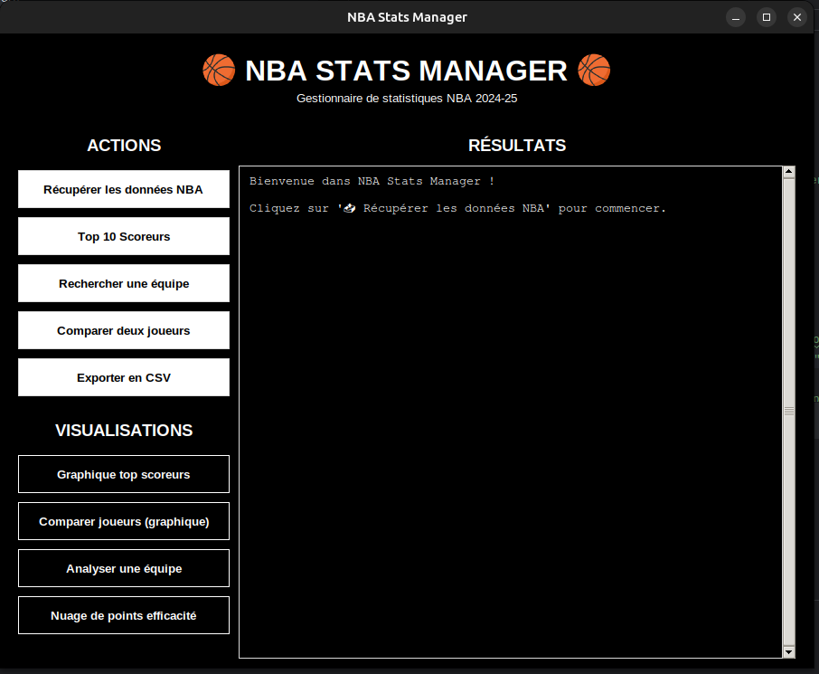

# 🏀 NBA Stats Manager - Gestionnaire de Statistiques NBA

> **Projet Python** - Application complète de récupération, stockage et visualisation de statistiques NBA en temps réel

## À propos

**NBA Stats Manager** est un outil Python permettant de récupérer les statistiques officielles de la NBA, de les stocker dans une base de données locale et de générer des visualisations professionnelles. Le projet propose à la fois une **interface en ligne de commande** et une **interface graphique moderne** pour une utilisation intuitive.

### Contexte du projet
- **Langage** : Python
- **Objectif** : Apprentissage de Python à travers un projet concret
- **Compétences** : APIs REST, bases de données, visualisation de données, interfaces graphiques

---

## Captures d'écran

<div align="center">
  
  <p><em>Interface graphique</em></p>
</div>


### Graphiques générés
Les visualisations sont exportées en haute résolution (300 DPI) :
- `top_scorers.png` - Classement des meilleurs scoreurs
- `player_comparison.png` - Comparaison statistique de deux joueurs
- `team_analysis.png` - Analyse complète d'une équipe
- `efficiency_scatter.png` - Nuage de points points/efficacité
- `shooting_percentages.png` - Pourcentages de tir

---

## Technologies utilisées

| Composant | Technologies                 |
|-----------|------------------------------|
| **Langage** | Python                       |
| **API** | nba_api (API officielle NBA) |
| **Base de données** | SQLite3                      |
| **Manipulation de données** | pandas                       |
| **Visualisation** | matplotlib                   |
| **Interface graphique** | Tkinter                      |
| **Gestion de projet** | Git, pip                     |

---

## Fonctionnalités

### Récupération de données

**API officielle NBA**
- Connexion à l'API stats.nba.com via `nba_api`
- Récupération des statistiques de la saison en cours (2024-25)
- Données disponibles : points, rebonds, passes, interceptions, contres, pourcentages de tir
- Plus de 400 joueurs NBA référencés

**Gestion robuste des erreurs**
- Timeout et retry automatiques
- Messages d'erreur clairs
- Validation des données récupérées

### Base de données SQLite

**Tables structurées**
```sql
CREATE TABLE players (
    player_id INTEGER PRIMARY KEY,
    player_name TEXT NOT NULL,
    team_name TEXT,
    position TEXT,
    games_played INTEGER,
    points_per_game REAL,
    rebounds_per_game REAL,
    assists_per_game REAL,
    steals_per_game REAL,
    blocks_per_game REAL,
    field_goal_pct REAL,
    three_point_pct REAL,
    free_throw_pct REAL,
    season TEXT,
    last_updated TIMESTAMP DEFAULT CURRENT_TIMESTAMP
);
```

**Requêtes SQL optimisées**
- Recherche par joueur, équipe ou statistique
- Tri et filtrage
- Jointures et agrégations
- Export CSV

### Visualisations (graphiques)

**5 types de graphiques**

1. **Top scoreurs** - Graphique en barres horizontales
   - Affiche les 10 meilleurs scoreurs
   - Valeurs annotées sur les barres
   - Tri automatique par PPG

2. **Comparaison de joueurs** - Graphique en barres groupées
   - Compare deux joueurs sur 5 catégories (PPG, RPG, APG, SPG, BPG)
   - Couleurs distinctes par joueur
   - Légende claire

3. **Analyse d'équipe** - Graphique multi-barres
   - Affiche les 8 meilleurs joueurs d'une équipe
   - 3 statistiques par joueur (PPG, RPG, APG)
   - Vue d'ensemble de la profondeur d'effectif

4. **Nuage de points efficacité** - Scatter plot
   - Corrélation points vs efficacité globale
   - Taille des points = nombre de matchs joués
   - Couleur = nombre de passes
   - Annotation des meilleurs joueurs

5. **Pourcentages de tir** - Graphique comparatif
   - Field Goal %, Three-Point %, Free Throw %
   - Top 10 scoreurs
   - Comparaison de l'efficacité offensive

**Caractéristiques graphiques**
- Résolution 300 DPI (qualité impression)
- Grilles discrètes pour meilleure lisibilité
- Police professionnelle (Arial, poids adapté)
- Couleurs neutres et contrastées
- Export PNG automatique

### Interfaces utilisateur

**1. Interface en ligne de commande (CLI)**
```
NBA STATS MANAGER - Menu Principal
============================================================
1. Récupérer les données depuis l'API NBA
2. Afficher le top 10 des scoreurs
3. Rechercher les stats d'une équipe
4. Exporter les données en CSV
5. Comparer deux joueurs
6. Calculer les scores d'efficacité
--- VISUALISATIONS ---
7. Graphique des top scoreurs
8. Comparer deux joueurs (graphique)
9. Analyser une équipe (graphique)
10. Nuage de points efficacité
11. Pourcentages de tir
0. Quitter
============================================================
```

**2. Interface graphique (GUI) avec Tkinter**
- Fenêtre principal
- Boutons cliquables pour chaque choix
- Zone d'affichage des résultats
- Dialogues pour saisie utilisateur
- Messages de confirmation/erreur
- Scrollbar

---

## Installation

### Prérequis
- **Python** : Version 3.8 ou supérieure
- **pip** : Gestionnaire de paquets Python
- **Système** : Linux, macOS, ou Windows

### Étapes d'installation

**1. Cloner le dépôt**
```bash
git clone https://github.com/Acelyamhrr/nba-dashboard.git
cd nba-dashboard/
```

**2. (Optionnel) Créer un environnement virtuel pour afficher l'interface graphique**
```bash
python -m venv .venv
source .venv/bin/activate  # Linux/Mac
# ou
.venv\Scripts\activate  # Windows
```

**3. Installer les dépendances**
```bash
pip install -r requirements.txt
```

---

## Utilisation

### Lancer l'interface graphique (recommandé)
```bash
python src/gui.py
```

L'interface s'ouvre dans une fenêtre Tkinter. Suivez les étapes :
1. Cliquez sur **"Récupérer les données NBA"** (première utilisation)
2. Attendez 5-10 secondes le téléchargement des stats
3. Explorez les différentes fonctionnalités via les boutons

### Lancer l'interface en ligne de commande
```bash
python src/main.py
```

**Menu interactif** :
- Tapez le numéro de l'option souhaitée
- Suivez les instructions à l'écran
- Les graphiques sont sauvegardés automatiquement

### Exemples d'utilisation

**Récupérer les données**
```
Votre choix: 1
Récupération des stats de la saison 2024-25...
✓ 445 joueurs récupérés
✓ 445 joueurs insérés/mis à jour
```

**Afficher le top 10**
```
Votre choix: 2
============================================================
RÉSUMÉ DES STATISTIQUES NBA
============================================================
1. Luka Dončić          DAL  | 35.2 PPG  8.9 RPG  9.1 APG
2. Nikola Jokić         DEN  | 32.5 PPG  12.8 RPG  11.1 APG
3. Shai Gilgeous-A.     OKC  | 31.8 PPG  5.5 RPG  6.3 APG
...
```

**Rechercher une équipe**
```
Votre choix: 3
Nom de l'équipe: Lakers
STATISTIQUES DE L'ÉQUIPE : LAKERS
Anthony Davis          PF  | 27.8 PPG  11.2 RPG  3.5 APG
LeBron James           SF  | 25.8 PPG  7.2 RPG  8.1 APG
...
```

**Comparer deux joueurs**
```
Votre choix: 5
Premier joueur: Jokic
Deuxième joueur: Giannis

Comparaison: Nikola Jokić vs Giannis Antetokounmpo
Statistique           Nikola Jokić         Giannis Antetokounmpo
Points/match          32.5                 30.4
Rebonds/match         12.8                 11.5
Passes/match          11.1                 5.8
...
```

**Générer un graphique**
```
Votre choix: 7
✓ Graphique sauvegardé: top_scorers.png
```

---

## Références et ressources

### APIs et données
- [nba_api Documentation](https://github.com/swar/nba_api)
- [NBA Official Stats](https://www.nba.com/stats)
- [Basketball Reference](https://www.basketball-reference.com/)

### Documentation Python
- [SQLite3 Python](https://docs.python.org/3/library/sqlite3.html)
- [pandas Documentation](https://pandas.pydata.org/docs/)
- [matplotlib Gallery](https://matplotlib.org/stable/gallery/index.html)
- [Tkinter Tutorial](https://docs.python.org/3/library/tkinter.html)

### Apprentissage
- *Automate the Boring Stuff with Python* - Al Sweigart
- *Python Data Science Handbook* - Jake VanderPlas
- [Real Python Tutorials](https://realpython.com/)

---

## Contribution

Les contributions sont les bienvenues ! Pour contribuer :

1. Forkez le projet
2. Créez une branche (`git checkout -b feature/amelioration`)
3. Committez vos changements (`git commit -m 'Ajout fonctionnalité X'`)
4. Pushez vers la branche (`git push origin feature/amelioration`)
5. Ouvrez une Pull Request

---

## Licence

Projet personnel - Libre d'utilisation à des fins éducatives

---

## Auteur

**Acelyamhrr**
- GitHub: [@Acelyamhrr](https://github.com/Acelyamhrr)
---